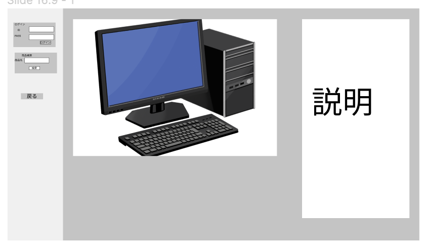

### 画面詳細図
## 商品詳細ページ
### プロトタイプは以下のページ
[プロトタイプ](https://www.figma.com/file/c1gfjan5MAbjdh2eJg9KOi/Untitled?node-id=0%3A1)
*****

*****
捕捉：対応DBの列はDB設計後、○を対応するテーブル・カラム名に差し替えること。

| ID | 要素 | 内容 | アクション | イベント | 対応DB |
